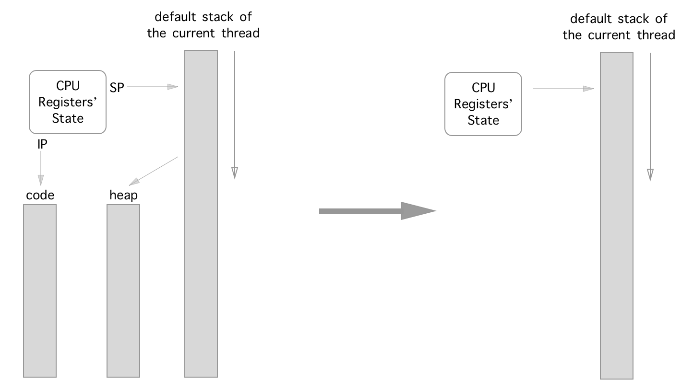
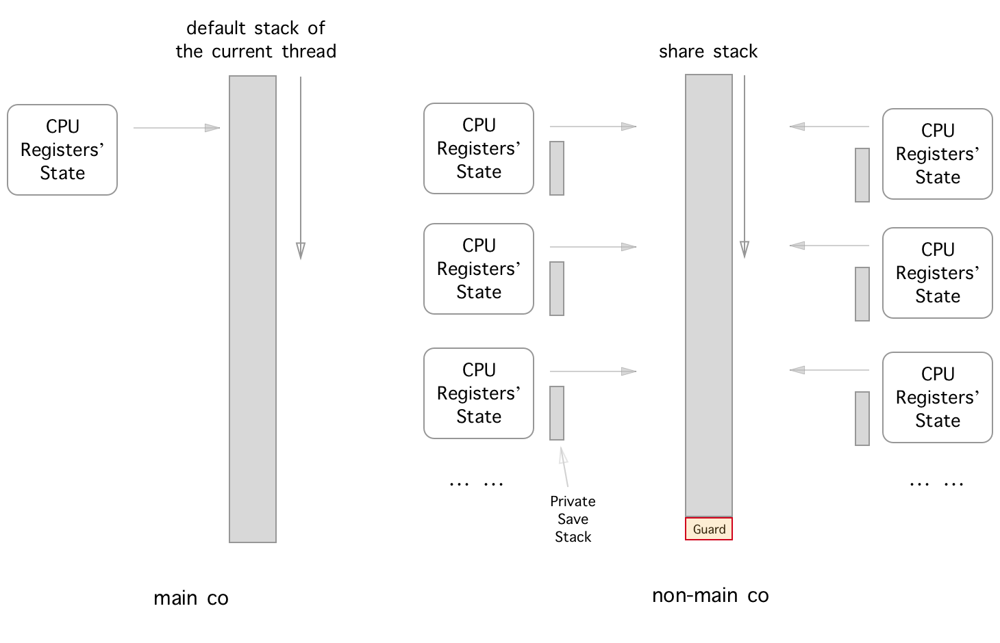
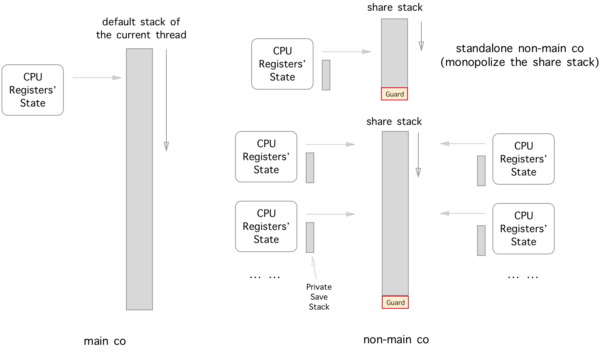
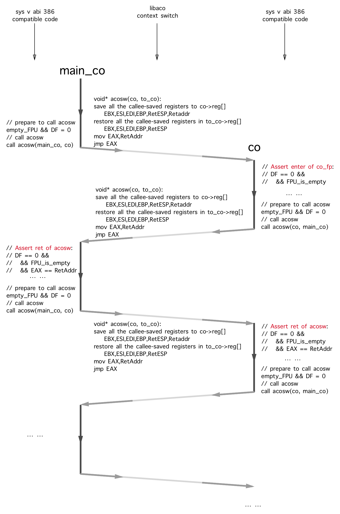
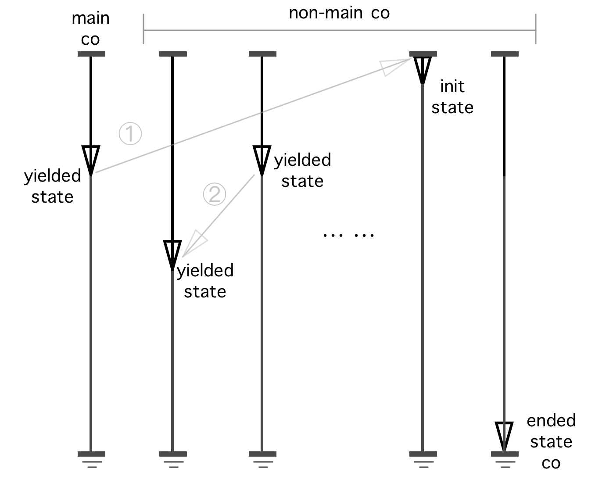
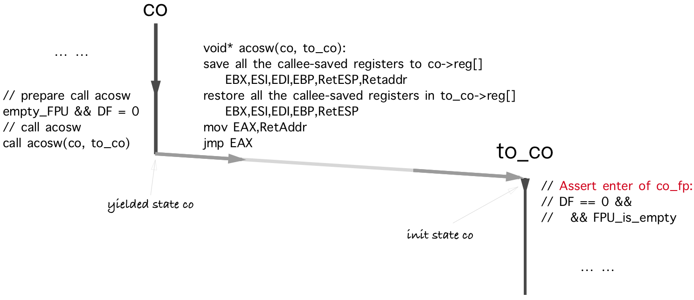
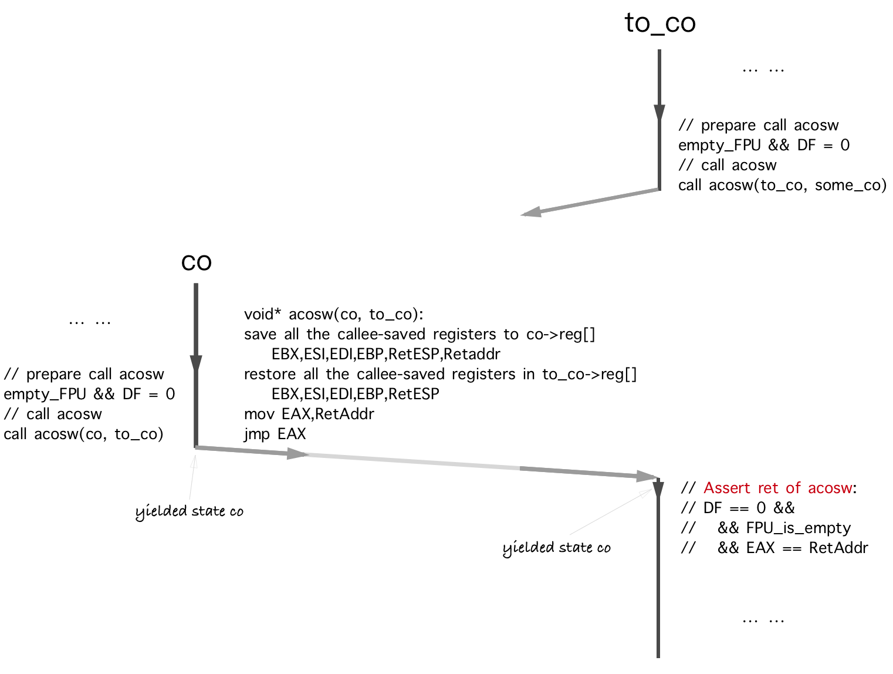

# Name
 
libaco - 一个极速的、轻量级、C语言非对称协程库。

这个项目的代号是Arkenstone 💎

Asymmetric COroutine 和 Arkenstone 是 aco 的名称来源。

当前支持Sys V ABI Intel386和Sys V ABI x86-64。

下面是这个项目的简要介绍：

- 除了一个生产级别的C协程库实现，还包含了一个详细的文档描述了如何实现一个 *最快且正确* 的协程库以及其严格的数学证明；
- 核心实现不超过 *700* 行代码，但包含了一个协程库应该有的全部功能；
- 在AWS c5d.large机器上的性能测试结果指出，一次协程间上下文切换仅耗时 *10 ns* （独立执行栈）；
- 用户在创建新的协程时，可以选择其拥有一个独占的执行栈，或者是与其它任意数量的协程一起共享一个执行栈；
- 拥有极致的内存使用效率：一千万个协程并发执行仅消耗2.8GB的物理内存（tcmalloc，每一个协程使用120B的复制栈）。

上文中的"最快"指的是在满足Sys V ABI Intel386或者AMD64约束下最快的上下文切换实现。

[](https://travis-ci.org/hnes/libaco)
[](https://github.com/hnes/libaco/releases)
[](https://github.com/hnes/libaco/blob/master/LICENSE)
[](https://twitter.com/intent/tweet?text=libaco+-+A+blazing+fast+and+lightweight+C+asymmetric+coroutine+library&url=https://github.com/hnes/libaco&via=00hnes)

热烈欢迎Issues和PRs 🎉🎉🎉

注意: 请使用Release而非Master分支进行最终的二进制程序构建。

[github-release]: https://github.com/hnes/libaco/releases

# Table of Contents

   * [Name](#name)
   * [Table of Contents](#table-of-contents)
   * [Status](#status)
   * [Synopsis](#synopsis)
   * [Description](#description)
   * [Build and Test](#build-and-test)
      * [CFLAGS](#cflags)
      * [Build](#build)
      * [Test](#test)
   * [Tutorials](#tutorials)
   * [API](#api)
      * [aco_thread_init](#aco_thread_init)
      * [aco_share_stack_new](#aco_share_stack_new)
      * [aco_share_stack_new2](#aco_share_stack_new2)
      * [aco_share_stack_destroy](#aco_share_stack_destroy)
      * [aco_create](#aco_create)
      * [aco_resume](#aco_resume)
      * [aco_yield](#aco_yield)
      * [aco_get_co](#aco_get_co)
      * [aco_get_arg](#aco_get_arg)
      * [aco_exit](#aco_exit)
      * [aco_destroy](#aco_destroy)
      * [MACROS](#macros)
   * [Benchmark](#benchmark)
   * [Proof of Correctness](#proof-of-correctness)
      * [Running Model](#running-model)
      * [Mathematical Induction](#mathematical-induction)
      * [Miscellaneous](#miscellaneous)
         * [Red Zone](#red-zone)
         * [Stack Pointer](#stack-pointer)
   * [Best Practice](#best-practice)
   * [TODO](#todo)
   * [CHANGES](#changes)
   * [Donation](#donation)
* [Copyright and License](#copyright-and-license)

# Status

可以用于生产环境。

# Synopsis

```c
#include "aco.h"    
#include <stdio.h>

// this header would override the default C `assert`;
// you may refer the "API : MACROS" part for more details.
#include "aco_assert_override.h"

void foo(int ct) {
    printf("co: %p: yield to main_co: %d\n", aco_get_co(), *((int*)(aco_get_arg())));
    aco_yield();
    *((int*)(aco_get_arg())) = ct + 1;
}

void co_fp0() {
    printf("co: %p: entry: %d\n", aco_get_co(), *((int*)(aco_get_arg())));
    int ct = 0;
    while(ct < 6){
        foo(ct);
        ct++;
    }
    printf("co: %p:  exit to main_co: %d\n", aco_get_co(), *((int*)(aco_get_arg())));
    aco_exit();
}

int main() {
    aco_thread_init(NULL);

    aco_t* main_co = aco_create(NULL, NULL, 0, NULL, NULL);
    aco_share_stack_t* sstk = aco_share_stack_new(0);

    int co_ct_arg_point_to_me = 0;
    aco_t* co = aco_create(main_co, sstk, 0, co_fp0, &co_ct_arg_point_to_me);

    int ct = 0;
    while(ct < 6){
        assert(co->is_end == 0);
        printf("main_co: yield to co: %p: %d\n", co, ct);
        aco_resume(co);
        assert(co_ct_arg_point_to_me == ct);
        ct++;
    }
    printf("main_co: yield to co: %p: %d\n", co, ct);
    aco_resume(co);
    assert(co_ct_arg_point_to_me == ct);
    assert(co->is_end);

    printf("main_co: destroy and exit\n");
    aco_destroy(co);
    co = NULL;
    aco_share_stack_destroy(sstk);
    sstk = NULL;
    aco_destroy(main_co);
    main_co = NULL;

    return 0;
}
```
```bash
# default build
$ gcc -g -O2 acosw.S aco.c test_aco_synopsis.c -o test_aco_synopsis
$ ./test_aco_synopsis
main_co: yield to co: 0x1887120: 0
co: 0x1887120: entry: 0
co: 0x1887120: yield to main_co: 0
main_co: yield to co: 0x1887120: 1
co: 0x1887120: yield to main_co: 1
main_co: yield to co: 0x1887120: 2
co: 0x1887120: yield to main_co: 2
main_co: yield to co: 0x1887120: 3
co: 0x1887120: yield to main_co: 3
main_co: yield to co: 0x1887120: 4
co: 0x1887120: yield to main_co: 4
main_co: yield to co: 0x1887120: 5
co: 0x1887120: yield to main_co: 5
main_co: yield to co: 0x1887120: 6
co: 0x1887120:  exit to main_co: 6
main_co: destroy and exit
# i386
$ gcc -g -m32 -O2 acosw.S aco.c test_aco_synopsis.c -o test_aco_synopsis
# share fpu and mxcsr env
$ gcc -g -D ACO_CONFIG_SHARE_FPU_MXCSR_ENV -O2 acosw.S aco.c test_aco_synopsis.c -o test_aco_synopsis 
# with valgrind friendly support
$ gcc -g -D ACO_USE_VALGRIND -O2 acosw.S aco.c test_aco_synopsis.c -o test_aco_synopsis
$ valgrind --leak-check=full --tool=memcheck ./test_aco_synopsis
```

关于构建的更多信息请查阅"[Build and Test](#build-and-test)"部分。

# Description



一个用户空间的执行状态（一般为OS线程）有四个基本要素:`{cpu_registers, code, heap, stack}`。

由于二进制程序的代码执行位置信息由`({E|R})?IP`寄存器决定，且从堆中分配出的内存地址信息一般会间接或者直接的保存在运行栈中，所以，我们可以将这个四个元素最终化简为`{cpu_registers, stack}`。



我们定义`main co`（主协程）为独占使用当前运行线程默认执行栈的协程。由于main co是这个执行栈的唯一用户，所以，在与main co相关的协程上下文切换中，我们仅需要对main co的某些必须的寄存器进行保存和恢复即可。

接着，我们定义`non-main co`（非主协程）为执行栈不是当前运行线程默认执行栈（而是它自己创建的，且有可能会与其他non-main co一起共享这个执行栈）的协程。所以，`non-main co`会有一个私有的保存栈，当它被切换进来（或者切换出去）时，会使用它的私有保存栈进行执行栈的恢复（或者保存），因为当它被切换进来（或者切换出去）时，之前的（或者之后的）运行协程可能已经使用了（或者可能将会使用）这个执行栈（在libaco实现中，私有保存栈的保存策略是惰性的最优方案，具体请参见aco_resume的源码实现细节）。


这是一个non-main co的特殊情况，在libaco中我们称之为`standalone non-main co`（独立非主协程），即独占一个执行栈的非主协程。在与standalone non-main co相关的上下文切换中，对其只需要进行一些必须寄存器的保存或恢复即可（因为它的执行栈是独占的，在它被切换出的时间里，它的执行栈的状态是不变的）。



最终，我们得到了libaco的全局鸟瞰图。

如果你想要实现自己的协程库或者更加深入的了解libaco的实现，"[Proof of Correctness](#proof-of-correctness)" 部分将会非常有用。

接下来，可以阅读[教程](#tutorials)或者性能测试部分。[性能测试的报告](#benchmark)令人印象深刻同时发人深省。

# Build and Test

## CFLAGS

* `-m32`

编译器选项`-m32`能够帮助用户在AMD64平台上构建libaco的i386二进制程序。

* C macro: `ACO_CONFIG_SHARE_FPU_MXCSR_ENV`

如果用户的程序在运行期间不会更改FPU和MXCSR的控制字，那么可以选择定义全局C宏 `ACO_CONFIG_SHARE_FPU_MXCSR_ENV` 以轻微地加快协程间上下文切换的速度。如果该宏没有被定义，每一个协程将会维护一份属于自己的独立FPU和MXCSR控制字环境。由于更改FPU或者MXCSR控制字的应用代码是非常少见的，用户可以选择总是全局定义该宏，但是如果并不能保证这个约束，用户应该选择不定义该宏。

* C macro:`ACO_USE_VALGRIND`

如果用户想要使用valgrind的memcheck工具对libaco的应用程序进行测试，则需要在构建时定义全局C宏 `ACO_USE_VALGRIND` 以使能libaco对valgrind memcheck时的支持。 由于性能的原因，在最终的生产二进制构建中并不推荐使用此宏。在全局定义了此宏的libaco应用构建之前，用户需要安转valgrind的C头文件（以Centos为例，这个开发包的名称为"valgrind-devel"）。valgrind的memcheck现在只支持拥有独立运行栈的协程，memcheck在对使用共享栈的协程进行检测时会输出很多的误报。更多的信息可以查看"[test_aco_tutorial_6.c](test_aco_tutorial_6.c)"。

## Build

```bash
$ mkdir output
$ bash make.sh
```

make.sh脚本中有一些更加详细的构建参数：

```bash
$bash make.sh -h
Usage: make.sh [-o <no-m32|no-valgrind>] [-h]

Example:
    # default build
    bash make.sh
    # build without the i386 binary output
    bash make.sh -o no-m32
    # build without the valgrind supported binary output
    bash make.sh -o no-valgrind
    # build without the valgrind supported and i386 binary output
    bash make.sh -o no-valgrind -o no-m32
```

简而言之，如果系统中没有valgrind的C头文件，可以选择使用参数 `-o no-valgrind `进行测试集的构建；如果系统为AMD64平台并且没有安装32位的C编译器开发工具链，可以选择使用参数 `-o no-m32` 进行测试集的构建。

## Test

```bash
$ cd output
$ bash ../test.sh
```

# Tutorials

文件`test_aco_tutorial_0.c`中包含了libaco的基本使用示例。在这个示例中，只包含了一个 main co 和一个 standalone non-main co，另外，代码中的注释也很有用。

文件`test_aco_tutorial_1.c`中包含了libaco协程的运行统计信息的使用示例。类型`aco_t`的定义在`aco.h`中并且清晰易懂。

在文件`test_aco_tutorial_2.c`中，包含了一个standalone non-main co和两个共享同一个执行栈的non-main co。

文件`test_aco_tutorial_3.c`展示了如何在多线程环境中使用libaco。从根本上讲，为了获得最好的协程间上下文切换性能，在设计时一个libaco的运行实例应该仅仅工作在一个固定的线程中。这样，如果你想在多线程中使用libaco，只需要分别在各个线程中像在单线程中那样使用libaco一样使用它即可。在libaco内部没有任何的线程间数据共享；在多线程场景下，用户需要自己处理好自己的数据竞争问题（就像此实例中`gl_race_aco_yield_ct`线程间共享变量做的那样）。

在libaco中，请调用API `aco_exit()`来进行终结non-main co的执行，而不要直接使用默认的C关键字`return`进行返回（否则libaco会将这种行为当做异常事件并触发默认的protector流程：输出错误信息至stderr并立即调用`abort`来终结进程的执行）。源文件`test_aco_tutorial_4.c`中示范了一个违背了此规则的协程实例。

同时，用户也可以选择定制自己想要的protector处理逻辑（比如去做一些自定义的"last words"即“遗嘱”任务)。但是无论如何，当protector被执行完毕后，当前进程一定会被`abort`。源文件`test_aco_tutorial_5.c`中描述了如何自定义protector。

源文件`test_aco_tutorial_6.c`中示范了一个简单的协程调度器的实例。

# API

在阅读下面的API文档时，建议也可以同时阅读对应源码中的实现，因为源码非常的清晰易读。同时，在阅读API文档之前，推荐先阅读[教程](#tutorials)部分。

另外，在开始写libaco的应用之前，强烈建议先进行阅读[最佳实践](#best-practice)章节，此章节中除了描述如何应用libaco以让其性能发挥到极致，也描述了一些libaco编程时的注意事项。

注意：libaco的版本控制遵从[Semantic Versioning 2.0.0](https://semver.org/spec/v2.0.0.html)标准。所以，下面列出的所有API均有标准中所描述的兼容性保证（请注意，没有在下面API列表中的函数调用则没有如此的保证）。

## aco_thread_init

```c
typedef void (*aco_cofuncp_t)(void);
void aco_thread_init(aco_cofuncp_t last_word_co_fp);
```

在当前运行线程中初始化libaco的执行环境。

此API会将当前FPU与MXCSR的控制字保存到一个TLS全局变量中。

* 如果全局C宏 `ACO_CONFIG_SHARE_FPU_MXCSR_ENV` 没有被定义，保存的控制字接下来会被用来初始化新协程（`aco_create`）的FPU与MXCSR的控制字，然后每一个协程都将会在以后的协程上下文切换中独立维护这一份属于自己的FPU与MXCSR的控制字配置。
* 如果全局C宏 `ACO_CONFIG_SHARE_FPU_MXCSR_ENV` 被定义了，所有的协程将会共享同一份FPU与MXCSR的控制字配置。如果在这方面想了解更多，请查阅 "[Build and Test](#build-and-test)" 部分。

就像在 "[Tutorials](#tutorials)" 中关于 `test_aco_tutorial_5.c` 部分所陈述的那样，API的第一个入参`last_word_co_fp`为用户自定义的 "last words" 函数指针, 如果它的值非NULL，将会取代默认的protector handler（在进程abort之前做一些 "last words" 相关的事情）。在这样的 "last word" 函数中，用户可以调用API `aco_get_co` 以获得当前协程的指针。可以通过阅读源文件`test_aco_tutorial_5.c`以获得与此相关的更多信息。

## aco_share_stack_new

```c
aco_share_stack_t* aco_share_stack_new(size_t sz);
```

等价于调用`aco_share_stack_new2(sz, 1)`。

## aco_share_stack_new2

```c
aco_share_stack_t* aco_share_stack_new2(size_t sz, char guard_page_enabled);
```

创建一个新的执行栈，入参`sz`是对要创建执行栈的大小的一个建议性字节值，入参`guard_page_enabled`决定了要创建的执行栈是否会拥有一个只读的 "guard page" （可以用来检测执行栈的溢出）。

当第一入参`sz`为0时，表示选择使用默认的大小值（2MB）。经过一系列关于内存对齐和保留的运算后，该API保证最终创建出的执行栈满足下列所有条件：

* `final_valid_sz >= 4096`
* `final_valid_sz >= sz`
* `final_valid_sz % page_size == 0 if the guard_page_enabled != 0`

并且尽可能的接近入参`sz`的值。

当第二入参`guard_page_enabled`的值为1时，创建的执行栈将会拥有一个只读的用来检测执行栈溢出的 "guard page"，为0时则不会拥有这样的 "guard page" 。

此函数总是成功地返回一个可用的执行栈。

## aco_share_stack_destroy

```c
void aco_share_stack_destroy(aco_share_stack_t* sstk);
```

销毁执行栈`sstk`。

在销毁执行栈`sstk`之前，请确定所有使用这个执行栈的协程已经全部被销毁。

## aco_create

```c
typedef void (*aco_cofuncp_t)(void);
aco_t* aco_create(aco_t* main_co，aco_share_stack_t* share_stack, 
        size_t save_stack_sz, aco_cofuncp_t co_fp, void* arg);
```

创建一个新的协程。

如果想创建一个main co，直接调用：`aco_create(NULL, NULL, 0, NULL, NULL)`。Main co是一个特殊的standalone coroutine，它的执行栈是当前线程默认的执行栈。在一个线程中，main co 是被第一个创建并且是在所有其他non-main coroutine之前就已经开始运行了的协程。

如果想使用此API创建一个non-main co：

* 第一个入参`main_co`指向当前线程中的main co，创建出的non-main co以后在调用API `aco_yield`时将会将执行流程转交给入参`main_co`指向的main co，入参`main co`必然非NULL；
* 第二个入参`share_stack`指向要创建的non-main co以后要使用的执行栈。`share_stack` 必然非NULL。
* 第三个入参`save_stack_sz`指定要创建的non-main co的私有保存栈的初始大小，其单位为字节。值0表示使用默认的初始大小64字节。由于在以后的non-main co执行过程中，如果其私有保存栈不够大时将会进行自动地大小调整，所以一般情况下，用户不需要担心它的值。但是，如果有巨量的协程(比如一千万个)相继的进行大小调整，将会给内存分配器带来一些性能冲击，所以一个更加明智的选择是，给入参`save_stack_sz`赋予一个协程运行期间保存栈需要的最大值（即`co->save_stack.max_cpsz`的值），查阅 "[最佳实践](#best-practice)" 部分以获得与此相关的更多优化信息。
* 第四个入参`co_fp`是要创建non-main co的入口函数指针。`co_fp`必然非NULL。
* 最后一个入参`arg`为一个指针值，将会设置为要创建non-main co的`co->arg`的值，`co->arg`一般用来作为协程的输入参数。

此API将会永远地成功返回一个可用的协程。同时，我们定义`aco_create`返回的non-main co处于 "init" 状态。

## aco_resume

```c
void aco_resume(aco_t* co);
```

从调用者处Yield出来并开始或者继续协程`co`的执行。

此API的调用者必须是main co并且必须是`co->main_co`，入参`co`必须是non-main co。

第一次Resume协程`co`时，将会开始`co`的执行（函数指针`co->fp`指向的函数）。如果协程`co`已经Yielded，`aco_resume`将会继续`co`的执行。

在API `aco_resume`被调用之后，我们定义调用者 -- main co 的状态为 "yielded" 。

## aco_yield

```c
void aco_yield();
```

从调用者`co`处Yield出来并且Resume `co->main_co`的执行。

此API的调用者必须为non-main co，`co->main_co`必须非NULL。

在API `aco_yield`被调用之后，我们定义`co`的状态为 "yielded" 。

## aco_get_co

```c
aco_t* aco_get_co();
```

返回当前non-main co的指针。此API的调用者必须是non-main co。

## aco_get_arg

```c
void* aco_get_arg();
```

等价于`(aco_get_co()->arg)`。同样的，此API的调用者必须是non-main co。

## aco_exit

```c
void aco_exit();
```

除了与`aco_yield()`一样的功能之外，`aco_exit()`会另外设置`co->is_end`为1，以标志`co`的状态为 "end" 。

## aco_destroy

```c
void aco_destroy(aco_t* co);
```

销毁协程`co`。入参`co`必须非NULL。如果`co`是一个non-main co，此API也会同时销毁`co`的私有保存栈。

## MACROS

### Version

```c
#define ACO_VERSION_MAJOR 1
#define ACO_VERSION_MINOR 2
#define ACO_VERSION_PATCH 2
```

这三个关于libaco版本值的宏定义在头文件`aco.h`中，它们的值遵守标准：[Semantic Versioning 2.0.0](https://semver.org/spec/v2.0.0.html)。

### aco_assert_override.h

```c
// provide the compiler with branch prediction information
#define likely(x)               aco_likely(x)
#define unlikely(x)             aco_unlikely(x)

// override the default `assert` for convenience when coding
#define assert(EX)              aco_assert(EX)

// equal to `assert((ptr) != NULL)`
#define assertptr(ptr)          aco_assertptr(ptr)

// assert the successful return of memory allocation
#define assertalloc_bool(b)     aco_assertalloc_bool(b)
#define assertalloc_ptr(ptr)    aco_assertalloc_ptr(ptr)
```

像源文件[test_aco_synopsis.c](test_aco_synopsis.c) 所做的那样，用户可以选择在自己的应用源码中include头文件`"aco_assert_override.h"`来替换掉C默认的 "[assert](http://man7.org/linux/man-pages/man3/assert.3.html)" 以及定义除了`assert`之外的其它五个宏（如上所示）。因为C的 "[assert](http://man7.org/linux/man-pages/man3/assert.3.html)" 也是一个宏定义，所以在include头文件 `"aco_assert_override.h"` 时，应该将它放到源文件中所有include指令中的最后一个。如果在一个源文件中，用户想要在某个源文件中使用默认的C "[assert](http://man7.org/linux/man-pages/man3/assert.3.html)"，请不要在其中include这个头文件。

阅读源文件[aco_assert_override.h](aco_assert_override.h)以获得关于此的更多信息。

# Benchmark

Date: Sat Jun 30 UTC 2018.

Machine: [c5d.large on AWS](https://aws.amazon.com/cn/blogs/aws/now-available-compute-intensive-c5-instances-for-amazon-ec2/).

OS: RHEL-7.5 (Red Hat Enterprise Linux 7.5).

下面是关于性能测试部分的一个摘要描述：

* 一次协程间上下文切换仅耗时 **10.29 ns** （协程拥有独立的运行栈，并且协程间共享FPU与MXCSR控制字配置的情况下）；
* 一次协程间上下文切换仅耗时 **10.38 ns** （协程拥有独立的运行栈,并且各协程均维护一份属于各自的FPU与MXCSR控制字配置的情况下）；
* 极致的内存使用率：一千万个协程并发执行仅消耗2.8GB的物理内存（tcmalloc，每一个协程使用120B的复制栈）。

```
$ LD_PRELOAD=/usr/lib64/libtcmalloc_minimal.so.4 ./test_aco_benchmark..no_valgrind.shareFPUenv

+build:x86_64
+build:-DACO_CONFIG_SHARE_FPU_MXCSR_ENV
+build:share fpu & mxcsr control words between coroutines
+build:undefined ACO_USE_VALGRIND
+build:without valgrind memcheck friendly support

sizeof(aco_t)=152:


comment                                             task_amount  all_time_cost   ns_per_op          speed

aco_create/init_save_stk_sz=64B                              1     0.000 s      230.00 ns/op    4347824.79 op/s
aco_resume/co_amount=1/copy_stack_size=0B             20000000     0.412 s       20.59 ns/op   48576413.55 op/s
  -> acosw                                            40000000     0.412 s       10.29 ns/op   97152827.10 op/s
aco_destroy                                                  1     0.000 s      650.00 ns/op    1538461.66 op/s

aco_create/init_save_stk_sz=64B                              1     0.000 s      200.00 ns/op    5000001.72 op/s
aco_resume/co_amount=1/copy_stack_size=0B             20000000     0.412 s       20.61 ns/op   48525164.25 op/s
  -> acosw                                            40000000     0.412 s       10.30 ns/op   97050328.50 op/s
aco_destroy                                                  1     0.000 s      666.00 ns/op    1501501.49 op/s

aco_create/init_save_stk_sz=64B                        2000000     0.131 s       65.50 ns/op   15266771.53 op/s
aco_resume/co_amount=2000000/copy_stack_size=8B       20000000     0.666 s       33.29 ns/op   30043022.64 op/s
aco_destroy                                            2000000     0.066 s       32.87 ns/op   30425152.25 op/s

aco_create/init_save_stk_sz=64B                        2000000     0.130 s       65.22 ns/op   15332218.24 op/s
aco_resume/co_amount=2000000/copy_stack_size=24B      20000000     0.675 s       33.75 ns/op   29630018.73 op/s
aco_destroy                                            2000000     0.067 s       33.45 ns/op   29898311.36 op/s

aco_create/init_save_stk_sz=64B                        2000000     0.131 s       65.42 ns/op   15286937.97 op/s
aco_resume/co_amount=2000000/copy_stack_size=40B      20000000     0.669 s       33.45 ns/op   29891277.59 op/s
aco_destroy                                            2000000     0.080 s       39.87 ns/op   25084242.29 op/s

aco_create/init_save_stk_sz=64B                        2000000     0.224 s      111.86 ns/op    8940010.49 op/s
aco_resume/co_amount=2000000/copy_stack_size=56B      20000000     0.678 s       33.88 ns/op   29515473.53 op/s
aco_destroy                                            2000000     0.067 s       33.42 ns/op   29922412.68 op/s

aco_create/init_save_stk_sz=64B                        2000000     0.131 s       65.74 ns/op   15211896.70 op/s
aco_resume/co_amount=2000000/copy_stack_size=120B     20000000     0.769 s       38.45 ns/op   26010724.94 op/s
aco_destroy                                            2000000     0.088 s       44.11 ns/op   22669240.25 op/s

aco_create/init_save_stk_sz=64B                       10000000     1.240 s      123.97 ns/op    8066542.54 op/s
aco_resume/co_amount=10000000/copy_stack_size=8B      40000000     1.327 s       33.17 ns/op   30143409.55 op/s
aco_destroy                                           10000000     0.328 s       32.82 ns/op   30467658.05 op/s

aco_create/init_save_stk_sz=64B                       10000000     0.659 s       65.94 ns/op   15165717.02 op/s
aco_resume/co_amount=10000000/copy_stack_size=24B     40000000     1.345 s       33.63 ns/op   29737708.53 op/s
aco_destroy                                           10000000     0.337 s       33.71 ns/op   29666697.09 op/s

aco_create/init_save_stk_sz=64B                       10000000     0.654 s       65.38 ns/op   15296191.35 op/s
aco_resume/co_amount=10000000/copy_stack_size=40B     40000000     1.348 s       33.71 ns/op   29663992.77 op/s
aco_destroy                                           10000000     0.336 s       33.56 ns/op   29794574.96 op/s

aco_create/init_save_stk_sz=64B                       10000000     0.653 s       65.29 ns/op   15316087.09 op/s
aco_resume/co_amount=10000000/copy_stack_size=56B     40000000     1.384 s       34.60 ns/op   28902221.24 op/s
aco_destroy                                           10000000     0.337 s       33.73 ns/op   29643682.93 op/s

aco_create/init_save_stk_sz=64B                       10000000     0.652 s       65.19 ns/op   15340872.40 op/s
aco_resume/co_amount=10000000/copy_stack_size=120B    40000000     1.565 s       39.11 ns/op   25566255.73 op/s
aco_destroy                                           10000000     0.443 s       44.30 ns/op   22574242.55 op/s

aco_create/init_save_stk_sz=64B                        2000000     0.131 s       65.61 ns/op   15241722.94 op/s
aco_resume/co_amount=2000000/copy_stack_size=136B     20000000     0.947 s       47.36 ns/op   21114212.05 op/s
aco_destroy                                            2000000     0.125 s       62.35 ns/op   16039466.45 op/s

aco_create/init_save_stk_sz=64B                        2000000     0.131 s       65.71 ns/op   15218784.72 op/s
aco_resume/co_amount=2000000/copy_stack_size=136B     20000000     0.948 s       47.39 ns/op   21101216.29 op/s
aco_destroy                                            2000000     0.125 s       62.73 ns/op   15941559.26 op/s

aco_create/init_save_stk_sz=64B                        2000000     0.131 s       65.49 ns/op   15270258.18 op/s
aco_resume/co_amount=2000000/copy_stack_size=152B     20000000     1.069 s       53.44 ns/op   18714275.17 op/s
aco_destroy                                            2000000     0.122 s       61.05 ns/op   16378678.85 op/s

aco_create/init_save_stk_sz=64B                        2000000     0.132 s       65.91 ns/op   15171336.62 op/s
aco_resume/co_amount=2000000/copy_stack_size=232B     20000000     1.190 s       59.48 ns/op   16813230.99 op/s
aco_destroy                                            2000000     0.123 s       61.26 ns/op   16324298.25 op/s

aco_create/init_save_stk_sz=64B                        2000000     0.131 s       65.68 ns/op   15224361.30 op/s
aco_resume/co_amount=2000000/copy_stack_size=488B     20000000     1.828 s       91.40 ns/op   10941133.56 op/s
aco_destroy                                            2000000     0.145 s       72.56 ns/op   13781182.82 op/s

aco_create/init_save_stk_sz=64B                        2000000     0.132 s       65.80 ns/op   15197461.34 op/s
aco_resume/co_amount=2000000/copy_stack_size=488B     20000000     1.829 s       91.47 ns/op   10932139.32 op/s
aco_destroy                                            2000000     0.149 s       74.70 ns/op   13387258.82 op/s

aco_create/init_save_stk_sz=64B                        1000000     0.067 s       66.63 ns/op   15007426.35 op/s
aco_resume/co_amount=1000000/copy_stack_size=1000B    20000000     4.224 s      211.20 ns/op    4734744.76 op/s
aco_destroy                                            1000000     0.093 s       93.36 ns/op   10711651.49 op/s

aco_create/init_save_stk_sz=64B                        1000000     0.066 s       66.28 ns/op   15086953.73 op/s
aco_resume/co_amount=1000000/copy_stack_size=1000B    20000000     4.222 s      211.12 ns/op    4736537.93 op/s
aco_destroy                                            1000000     0.094 s       94.09 ns/op   10627664.78 op/s

aco_create/init_save_stk_sz=64B                         100000     0.007 s       70.72 ns/op   14139923.59 op/s
aco_resume/co_amount=100000/copy_stack_size=1000B     20000000     4.191 s      209.56 ns/op    4771909.70 op/s
aco_destroy                                             100000     0.010 s      101.21 ns/op    9880747.28 op/s

aco_create/init_save_stk_sz=64B                         100000     0.007 s       66.62 ns/op   15010433.00 op/s
aco_resume/co_amount=100000/copy_stack_size=2024B     20000000     7.002 s      350.11 ns/op    2856228.03 op/s
aco_destroy                                             100000     0.016 s      159.69 ns/op    6262129.35 op/s

aco_create/init_save_stk_sz=64B                         100000     0.007 s       65.76 ns/op   15205994.08 op/s
aco_resume/co_amount=100000/copy_stack_size=4072B     20000000    11.918 s      595.90 ns/op    1678127.54 op/s
aco_destroy                                             100000     0.019 s      186.32 ns/op    5367189.85 op/s

aco_create/init_save_stk_sz=64B                         100000     0.006 s       63.03 ns/op   15865531.37 op/s
aco_resume/co_amount=100000/copy_stack_size=7992B     20000000    21.808 s     1090.42 ns/op     917079.11 op/s
aco_destroy                                             100000     0.038 s      378.33 ns/op    2643225.42 op/s
```

```
$ LD_PRELOAD=/usr/lib64/libtcmalloc_minimal.so.4 ./test_aco_benchmark..no_valgrind.standaloneFPUenv

+build:x86_64
+build:undefined ACO_CONFIG_SHARE_FPU_MXCSR_ENV
+build:each coroutine maintain each own fpu & mxcsr control words
+build:undefined ACO_USE_VALGRIND
+build:without valgrind memcheck friendly support

sizeof(aco_t)=160:


comment                                             task_amount  all_time_cost   ns_per_op          speed

aco_create/init_save_stk_sz=64B                              1     0.000 s      273.00 ns/op    3663004.27 op/s
aco_resume/co_amount=1/copy_stack_size=0B             20000000     0.415 s       20.76 ns/op   48173877.75 op/s
  -> acosw                                            40000000     0.415 s       10.38 ns/op   96347755.51 op/s
aco_destroy                                                  1     0.000 s      381.00 ns/op    2624672.26 op/s

aco_create/init_save_stk_sz=64B                              1     0.000 s      212.00 ns/op    4716980.43 op/s
aco_resume/co_amount=1/copy_stack_size=0B             20000000     0.415 s       20.75 ns/op   48185455.26 op/s
  -> acosw                                            40000000     0.415 s       10.38 ns/op   96370910.51 op/s
aco_destroy                                                  1     0.000 s      174.00 ns/op    5747123.38 op/s

aco_create/init_save_stk_sz=64B                        2000000     0.131 s       65.63 ns/op   15237386.02 op/s
aco_resume/co_amount=2000000/copy_stack_size=8B       20000000     0.664 s       33.20 ns/op   30119155.82 op/s
aco_destroy                                            2000000     0.065 s       32.67 ns/op   30604542.55 op/s

aco_create/init_save_stk_sz=64B                        2000000     0.131 s       65.33 ns/op   15305975.29 op/s
aco_resume/co_amount=2000000/copy_stack_size=24B      20000000     0.675 s       33.74 ns/op   29638360.61 op/s
aco_destroy                                            2000000     0.067 s       33.31 ns/op   30016633.42 op/s

aco_create/init_save_stk_sz=64B                        2000000     0.131 s       65.61 ns/op   15241767.78 op/s
aco_resume/co_amount=2000000/copy_stack_size=40B      20000000     0.678 s       33.88 ns/op   29518648.08 op/s
aco_destroy                                            2000000     0.079 s       39.74 ns/op   25163018.30 op/s

aco_create/init_save_stk_sz=64B                        2000000     0.221 s      110.73 ns/op    9030660.30 op/s
aco_resume/co_amount=2000000/copy_stack_size=56B      20000000     0.684 s       34.18 ns/op   29253416.65 op/s
aco_destroy                                            2000000     0.067 s       33.40 ns/op   29938840.64 op/s

aco_create/init_save_stk_sz=64B                        2000000     0.131 s       65.60 ns/op   15244077.65 op/s
aco_resume/co_amount=2000000/copy_stack_size=120B     20000000     0.769 s       38.43 ns/op   26021228.41 op/s
aco_destroy                                            2000000     0.087 s       43.74 ns/op   22863987.42 op/s

aco_create/init_save_stk_sz=64B                       10000000     1.251 s      125.08 ns/op    7994958.59 op/s
aco_resume/co_amount=10000000/copy_stack_size=8B      40000000     1.327 s       33.19 ns/op   30133654.80 op/s
aco_destroy                                           10000000     0.329 s       32.85 ns/op   30439787.32 op/s

aco_create/init_save_stk_sz=64B                       10000000     0.674 s       67.37 ns/op   14843796.57 op/s
aco_resume/co_amount=10000000/copy_stack_size=24B     40000000     1.354 s       33.84 ns/op   29548523.05 op/s
aco_destroy                                           10000000     0.339 s       33.90 ns/op   29494634.83 op/s

aco_create/init_save_stk_sz=64B                       10000000     0.672 s       67.19 ns/op   14882262.88 op/s
aco_resume/co_amount=10000000/copy_stack_size=40B     40000000     1.361 s       34.02 ns/op   29393520.19 op/s
aco_destroy                                           10000000     0.338 s       33.77 ns/op   29609577.59 op/s

aco_create/init_save_stk_sz=64B                       10000000     0.673 s       67.31 ns/op   14857716.02 op/s
aco_resume/co_amount=10000000/copy_stack_size=56B     40000000     1.371 s       34.27 ns/op   29181897.80 op/s
aco_destroy                                           10000000     0.339 s       33.85 ns/op   29540633.63 op/s

aco_create/init_save_stk_sz=64B                       10000000     0.672 s       67.24 ns/op   14873017.10 op/s
aco_resume/co_amount=10000000/copy_stack_size=120B    40000000     1.548 s       38.71 ns/op   25835542.17 op/s
aco_destroy                                           10000000     0.446 s       44.61 ns/op   22415961.64 op/s

aco_create/init_save_stk_sz=64B                        2000000     0.132 s       66.01 ns/op   15148290.52 op/s
aco_resume/co_amount=2000000/copy_stack_size=136B     20000000     0.944 s       47.22 ns/op   21177946.19 op/s
aco_destroy                                            2000000     0.124 s       61.99 ns/op   16132721.97 op/s

aco_create/init_save_stk_sz=64B                        2000000     0.133 s       66.36 ns/op   15068860.85 op/s
aco_resume/co_amount=2000000/copy_stack_size=136B     20000000     0.944 s       47.20 ns/op   21187541.38 op/s
aco_destroy                                            2000000     0.124 s       62.21 ns/op   16073322.25 op/s

aco_create/init_save_stk_sz=64B                        2000000     0.131 s       65.62 ns/op   15238955.93 op/s
aco_resume/co_amount=2000000/copy_stack_size=152B     20000000     1.072 s       53.61 ns/op   18652789.74 op/s
aco_destroy                                            2000000     0.121 s       60.42 ns/op   16551368.04 op/s

aco_create/init_save_stk_sz=64B                        2000000     0.132 s       66.08 ns/op   15132547.65 op/s
aco_resume/co_amount=2000000/copy_stack_size=232B     20000000     1.198 s       59.88 ns/op   16699389.91 op/s
aco_destroy                                            2000000     0.121 s       60.71 ns/op   16471465.52 op/s

aco_create/init_save_stk_sz=64B                        2000000     0.133 s       66.50 ns/op   15036985.95 op/s
aco_resume/co_amount=2000000/copy_stack_size=488B     20000000     1.853 s       92.63 ns/op   10796126.04 op/s
aco_destroy                                            2000000     0.146 s       72.87 ns/op   13723559.36 op/s

aco_create/init_save_stk_sz=64B                        2000000     0.132 s       66.14 ns/op   15118324.13 op/s
aco_resume/co_amount=2000000/copy_stack_size=488B     20000000     1.855 s       92.75 ns/op   10781572.22 op/s
aco_destroy                                            2000000     0.152 s       75.79 ns/op   13194130.51 op/s

aco_create/init_save_stk_sz=64B                        1000000     0.067 s       66.97 ns/op   14931921.56 op/s
aco_resume/co_amount=1000000/copy_stack_size=1000B    20000000     4.218 s      210.90 ns/op    4741536.66 op/s
aco_destroy                                            1000000     0.093 s       93.16 ns/op   10734691.98 op/s

aco_create/init_save_stk_sz=64B                        1000000     0.066 s       66.49 ns/op   15039274.31 op/s
aco_resume/co_amount=1000000/copy_stack_size=1000B    20000000     4.216 s      210.81 ns/op    4743543.53 op/s
aco_destroy                                            1000000     0.094 s       93.97 ns/op   10641539.58 op/s

aco_create/init_save_stk_sz=64B                         100000     0.007 s       70.95 ns/op   14094724.73 op/s
aco_resume/co_amount=100000/copy_stack_size=1000B     20000000     4.190 s      209.52 ns/op    4772746.50 op/s
aco_destroy                                             100000     0.010 s      100.99 ns/op    9902271.51 op/s

aco_create/init_save_stk_sz=64B                         100000     0.007 s       66.49 ns/op   15040038.84 op/s
aco_resume/co_amount=100000/copy_stack_size=2024B     20000000     7.028 s      351.38 ns/op    2845942.55 op/s
aco_destroy                                             100000     0.016 s      159.15 ns/op    6283444.42 op/s

aco_create/init_save_stk_sz=64B                         100000     0.007 s       65.73 ns/op   15214482.36 op/s
aco_resume/co_amount=100000/copy_stack_size=4072B     20000000    11.879 s      593.95 ns/op    1683636.60 op/s
aco_destroy                                             100000     0.018 s      184.23 ns/op    5428119.00 op/s

aco_create/init_save_stk_sz=64B                         100000     0.006 s       63.41 ns/op   15771072.16 op/s
aco_resume/co_amount=100000/copy_stack_size=7992B     20000000    21.808 s     1090.42 ns/op     917081.56 op/s
aco_destroy                                             100000     0.038 s      376.78 ns/op    2654073.13 op/s
```

# Proof of Correctness

首先，在开始实现或者证明一个协程库之前，必备的条件是要对[Sys V ABI of intel386 and x86-64](https://github.com/hjl-tools/x86-psABI/wiki/X86-psABI)标准非常的熟悉，以及一些基础的汇编知识。

接下来的证明中并没有包含关于IP（指令指针），SP（堆栈指针）和协程的私有保存栈与共享执行栈之间的保存与恢复的直接描述，因为相比于ABI约束的保证，这些东西是相当微不足道且容易实现和理解的。

## Running Model

在一个OS线程中，主协程`main_co`是被第一个创建并且是在所有其他non-main coroutine之前就已经开始运行了的协程。

下图是协程main co与co之间上下文切换的简单图示。

在这个证明中，我们假定我们的二进制程序要满足Sys V ABI intel386标准，因为Sys V ABI intel386与Sys V ABI x86-64之间没有根本的不同。为了简化描述，我们还假定二进制程序中没有会更改FPU或MXCSR控制字的代码存在。



下图实际上是对称协程的运行模型图（拥有不限量个non-main co和一个main co）。因为非对称协程仅仅是对称协程的一种特殊情况，所以我们如果证明了对称协程的正确性也就等于证明了非对称协程的正确性，如此会多些挑战性同时也会多些乐趣（libaco当前只实现了非对称协程的API，因为非对称协程的API语义远远比对称协程的API语义更容易理解和掌控）。



因为main co是在当前OS线程中第一个开始运行的协程，那么第一次协程间上下文切换一定是以`acosw(main_co, co)`这种形式存在的（这里，`acosw`的第二个入参`co`是一个non-main co）。

## Mathematical Induction

容易证明，在上图中只存在两类协程间的状态迁移：

* yielded state co → init state co
* yielded state co → yielded state co

要证明协程上下文切换函数`void* acosw(aco_t* from_co, aco_t* to_co)`的正确性，就等于要证明所有的协程在调用`acosw`前后都一直满足Sys V ABI规范的约束。我们假定协程中除了`acosw`之外的所有二进制均已经满足了ABI规范（它们一般是由编译器正确地生成的）。

下面是Sys V ABI Intel386函数调用约定中寄存器用法的总结：

```
Registers' usage in the calling convention of the Intel386 System V ABI:
    caller saved (scratch) registers:
        C1.0: EAX
            At the entry of a function call:
                could be any value
            After the return of `acosw`:
                hold the return value for `acosw`
        C1.1: ECX,EDX
            At the entry of a function call:
                could be any value
            After the return of `acosw`:
                could be any value
        C1.2: Arithmetic flags, x87 and mxcsr flags
            At the entry of a function call:
                could be any value
            After the return of `acosw`:
                could be any value
        C1.3: ST(0-7)
            At the entry of a function call:
                the stack of FPU must be empty
            After the return of `acosw`:
                the stack of FPU must be empty
        C1.4: Direction flag
            At the entry of a function call:
                DF must be 0
            After the return of `acosw`:
                DF must be 0
        C1.5: others: xmm*,ymm*,mm*,k*...
            At the entry of a function call:
                could be any value
            After the return of `acosw`:
                could be any value
    callee saved registers:
        C2.0: EBX,ESI,EDI,EBP
            At the entry of a function call:
                could be any value
            After the return of `acosw`:
                must be the same as it is at the entry of `acosw` 
        C2.1: ESP
            At the entry of a function call:
                must be a valid stack pointer
                (alignment of 16 bytes, retaddr and etc...)
            After the return of `acosw`:
                must be the same as it is before the call of `acosw`
        C2.2: control word of FPU & mxcsr
            At the entry of a function call:
                could be any configuration
            After the return of `acosw`:
                must be the same as it is before the call of `acosw` 
                (unless the caller of `acosw` assume `acosw` may    \
                change the control words of FPU or MXCSR on purpose \
                like `fesetenv`)
```

（对于Intel386，寄存器的用途定义在[Sys V ABI Intel386 V1.1](https://github.com/hjl-tools/x86-psABI/wiki/X86-psABI)的 "P13 - Table 2.3: Register Usage" 表中，对于AMD64则定义在[Sys V ABI AMD64 V1.0](https://github.com/hjl-tools/x86-psABI/wiki/X86-psABI)的 "P23 - Figure 3.4: Register Usage" 的图中。）

**Proof:**

1. yielded state co -> init state co:



上图详细地描绘了第一类状态迁移的过程： "yielded state co -> init state co" .

约束: C 1.0, 1.1, 1.2, 1.5 (*满足* ✓ )

下面列出的Scratch Registers在一个函数的入口点时其值可以为任意值：

```
EAX,ECX,EDX
XMM*,YMM*,MM*,K*...
status bits of EFLAGS,FPU,MXCSR
```

约束: C 1.3, 1.4 (*满足* ✓ )

由于在`acosw`被调用之前，FPU栈必然已空并且DF必然已为0（因为协程co的二进制代码已经满足ABI规范），所以，`acosw`满足约束C1.3和1.4。

约束: C 2.0, 2.1, 2.2 (*满足* ✓ )

约束C2.0和2.1已经被满足。由于我们已假定FPU与MXCSR的控制字在程序运行过程中不会被更改，所以约束C2.2也已经被`acosw`满足。

2. yielded state co -> yielded state co:



上图详细地描绘了第二类状态迁移的过程： yielded state co -> yielded state co.

约束: C 1.0 (*满足* ✓ )

很显然，当`acosw`返回到to_co时EAX中已经保存了预期的返回值。

约束: C 1.1, 1.2, 1.5 (*满足* ✓ )

下面列出的Scratch Registers在一个函数的入口点时以及在`acosw`返回后其值皆可为任意值：

```
ECX,EDX
XMM*,YMM*,MM*,K*...
status bits of EFLAGS,FPU,MXCSR
```

约束: C 1.3, 1.4 (*满足* ✓ )

由于在`acosw`被调用之前，FPU栈必然已空并且DF必然已为0（因为协程co的二进制代码已经满足ABI规范），所以，`acosw`满足约束C1.3和1.4。

约束: C 2.0, 2.1, 2.2 (*满足* ✓ )

从`acosw`调用者的角度来看，由于在`acosw`被调用（或返回）时，所有的callee saved registers都做了对应的保存（或恢复）工作，则约束C2.0与2.1被`acosw`满足。由于我们已假定FPU与MXCSR的控制字在程序运行过程中不会被更改，所以约束C2.2也已经被`acosw`满足。

3. Mathematical induction:

显然，在当前OS线程中，第一次`acosw`必然属于第一类状态迁移：yielded state co -> init state co，并且接下来的所有`acosw`必然属于这两类状态迁移的其中一类。顺序地用上面得到两个结论依次证明，最终得到“所有的协程在调用`acosw`前后都一直满足Sys V ABI规范的约束”结论。如此，证明结束。

## Miscellaneous

### Red Zone

在System V ABI x86-64中描述[red zone](https://en.wikipedia.org/wiki/Red_zone_(computing))的概念：

> The 128-byte area beyond the location pointed to by %rsp is considered to be reserved and shall not be modified by signal or interrupt handlers. Therefore, functions may use this area for temporary data that is not needed across function calls. In particular, leaf functions may use this area for their entire stack frame, rather than adjusting the stack pointer in the prologue and epilogue. This area is known as the red zone.

由于red zone "not preserved by the callee" ，所以我们在协程的上下文切换的实现中无需考虑它（因为`acosw`是一个叶子函数，即leaf function）。

### Stack Pointer

> The end of the input argument area shall be aligned on a 16 (32 or 64, if \_\_m256 or \_\_m512 is passed on stack) byte boundary. In other words, the value (%esp + 4) is always a multiple of 16 (32 or 64) when control is transferred to the function entry point. The stack pointer, %esp, always points to the end of the latest allocated stack frame.
>
> — Intel386-psABI-1.1:2.2.2 The Stack Frame

> The stack pointer, %rsp, always points to the end of the latest allocated stack frame.
>
> — Sys V ABI AMD64 Version 1.0:3.2.2 The Stack Frame

这是腾讯libco中的一个[bug](https://github.com/Tencent/libco/blob/v1.0/coctx_swap.S#L27)。ABI规范中规定用户空间程序的栈指针必须时刻指到运行栈的[栈顶](https://zh.wikipedia.org/wiki/%E5%A0%86%E6%A0%88#%E6%93%8D%E4%BD%9C)，而[coctx_swap.S](https://github.com/Tencent/libco/blob/v1.0/coctx_swap.S#L27)中却使用栈指针直接对位于堆中的数据结构进行寻址内存操作，这违反了ABI约定。

>**By default, the signal handler  is invoked  on  the normal process stack.**  It is possible to arrange that the signal handler uses an alternate stack; see sigalstack(2)  for  a discussion of how to do this and when it might be useful.
>
>— man 7 signal : Signal dispositions

当coctx_swap正在用栈指针对位于堆中的数据结构进行寻址内存操作时，若此时执行线程收到了一个信号，接着内核抢占了该执行线程并开始准备接下来用户空间线程的信号处理执行环境，由于在默认情况下，内核将会选择主栈作为信号处理函数的执行栈，但此时栈已经被指向了堆中（用户空间的程序违反ABI约定在先），那么信号处理函数的执行栈就会被错误的放置到堆中，这样，堆中的数据结构在接下来就极有可能会被破坏(更详细的bug复现请参见此[issue](https://github.com/Tencent/libco/issues/90))。

# Best Practice

总的来说，如果你想把libaco的性能发挥到极致，一定要保证 "non-standalone non-main co" 在调用`aco_yield`时的执行栈使用尽可能的小。另外，当你想把一个协程的局部变量的地址传递到另一个协程时一定要非常小心，因为如果这个变量是在共享栈上时，将可能会发生内存数据混乱，因此，总是从堆中分配需要在协程间共享的内存是一个非常明智的选择。

详细地说，有五点建议：

```
       co_fp 
       /  \
      /    \  
    f1     f2
   /  \    / \
  /    \  f4  \
yield  f3     f5
```

1. Main co的执行栈使用大小对协程间上下文切换的性能没有直接影响（因为main co独占了线程的默认执行栈）；

2. Standalone non-main co的执行栈使用大小对协程间上下文切换的性能没有直接影响（因为它独占了一个执行栈）。但是创建海量的standalone non-main co将会消耗海量的虚拟内存（因为海量执行栈的创建），因此，应用中并不推荐在一个线程中创建海量的standalone non-main co；

3. Non-standalone non-main co（与其他协程共享执行栈的非主协程）在调用`aco_yield`时执行栈的使用大小将会对协程间上下文切换的性能产生直接的影响，性能测试部分已经清楚的展示了这一点。在上图中，函数f2，f3，f4与f5的栈使用量对上下文切换的性能没有影响，这是因为在它们执行的过程中并没有`aco_yield`函数的来中断它们。然而，函数co_fp与f1的栈使用量之和将会决定`co->save_stack.max_cpsz`（协程运行期间私有保存栈的最大保存大小）的值，同时会对上下文切换的性能产生直接的影响；

让一个函数拥有尽可能低的栈使用量的关键是尽可能地从堆中分配局部变量（尤其是占用内存较大的变量）并手动地管理它们的生命周期（malloc/free），而非默认地从堆栈上分配和自动释放它们。C编译器gcc的选项`-fstack-usage`对此非常有用。

```c
int* gl_ptr;

void inc_p(int* p){ (*p)++; }

void co_fp0() {
    int ct = 0;
    gl_ptr = &ct; // line 7
    aco_yield();
    check(ct);
    int* ptr = &ct;
    inc_p(ptr);   // line 11
    aco_exit();
}

void co_fp1() {
    do_sth(gl_ptr); // line 16
    aco_exit();
}
```

4. 在上面的代码片段中，我们假定协程co_fp0与co_fp1共享同一个执行栈，它们均是non-main co，它们的执行顺序为 "co_fp0 -> co_fp1 -> co_fp0" 。因为它们共享同一个执行栈，在代码第16行`gl_ptr`中的指针值与代码第7行`gl_ptr`中的指针值二者的语义是不同的，这样的用法很可能会破坏协程co_fp1的执行栈。而代码第11行则是正确的，因为此时局部变量`ct`与函数`inc_p`的执行是在同一个协程上下文中的。从堆中分配需要在协程间共享的内存能够很简单地解决这类问题：

```c
int* gl_ptr;

void inc_p(int* p){ (*p)++; }

void co_fp0() {
    int* ct_ptr = malloc(sizeof(int));
    assert(ct_ptr != NULL);
    *ct_ptr = 0;
    gl_ptr = ct_ptr;
    aco_yield();
    check(*ct_ptr);
    int* ptr = ct_ptr;
    inc_p(ptr);
    free(ct_ptr);
    gl_ptr = NULL;
    aco_exit();
}

void co_fp1() {
    do_sth(gl_ptr);
    aco_exit();
}
```

# TODO

New ideas are welcome!

* Add a macro `aco_new` which is the combination of something like `p = malloc(sz); assertalloc_ptr(p)`.

* Add a new API `aco_reset` to support the reusability of the coroutine objects.

* Support other platforms (especially arm & arm64).

# CHANGES

```
v1.2.2 Mon Jul 9 2018
    Added a new option `-o <no-m32|no-valgrind>` to make.sh;
    Correction about the value of macro ACO_VERSION_PATCH (issue #1 
    kindly reported by Markus Elfring @elfring);
    Adjusted some noncompliant naming of identifiers (double underscore
    `__`) (issue #1, kindly proposed by Markus Elfring @elfring);
    Supported the header file including by C++ (issue #4, kindly
    proposed by Markus Elfring @elfring).
v1.2.1 Sat Jul 7 2018
    Fixed some noncompliant include guards in two C header files (
    issue #1 kindly reported by Markus Elfring @elfring);
    Removed the "pure" word from "pure C" statement since it is
    containing assembly codes (kindly reported by Peter Cawley
    @corsix);
    Many updates in the README.md document.
v1.2.0 Tue Jul 3 2018
    Provided another header named `aco_assert_override.h` so user
    could choose to override the default `assert` or not;
    Added some macros about the version information.
v1.1   Mon Jul 2 2018
    Removed the requirement on the GCC version (>= 5.0).
v1.0   Sun Jul 1 2018
    The v1.0 release of libaco, cheers 🎉🎉🎉
```

# Donation

我是一位自由的全职开源项目开发者，任何数量的捐赠对我都将会是莫大的鼓励 ;-)

* Paypal

  [paypal.me link](https://www.paypal.me/00hnes)

* Alipay (支付(宝|寶))


* Wechat (微信)


# Copyright and License

Copyright (C) 2018, by Sen Han [<00hnes@gmail.com>](mailto:00hnes@gmail.com).

Under the Apache License, Version 2.0.

See the [LICENSE](LICENSE) file for details.
